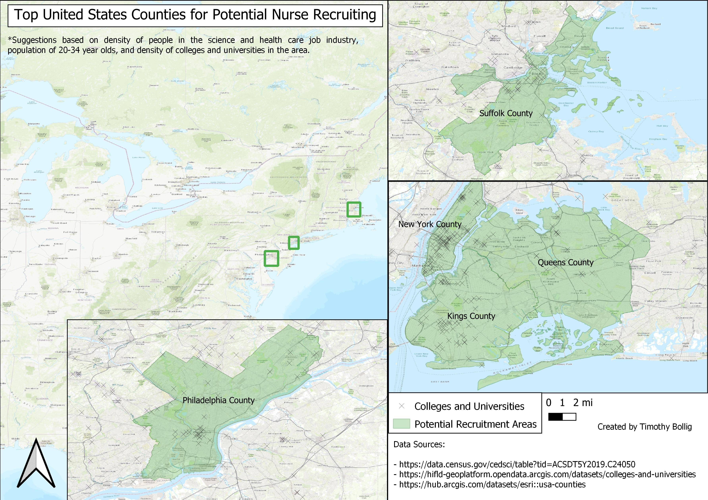

# Mapping Final Project

## Abstract: About 250 words summarizing your goal, analysis steps, and conclusions. Hint: Write this last (but put it first)

Nursing continues to grow into one of the most in demand professions with a massive skills gap projected for the near future.  In order to meet the labor demands of the job market, employers will need to seek out nursing talent from high potential areas of recruitment.  Utilizing United States Census data as well as additional spatial data sources, I worked to determine which counties in the United States might be considered “high potential” in terms of nursing recruitment.  Factors involved in determining which counties to suggest included the density of individuals with backgrounds in science or healthcare as well as the population of individuals in the county aged 20 to 34 years of age.  The final product is a map displaying these suggested counties.  Additionally, colleges and universities within the counties are plotted out.  It is my hope that this information could be used to help identify young professionals who may be looking for a new nursing jobs as well as individuals getting ready to graduate from nursing programs at the plotted colleges and universities.  Further study into the nursing programs of the colleges and universities is warranted and may reveal candidates for partnership in recruiting.

## Purpose/Inquiry Question: Develop an inquiry question concerning a topic of professional or personal interest which concerns the spatial distribution of data points.
What counties in the United States carry high potential for nursing recruitment?

## Background/Rationale and sources: Why is your inquiry question important? To Whom? What kinds of decisions are you conclusions informing? Also include a list of data sources and literature related to your topic. 2-5 sources is likely sufficient.

I decided on this inquiry question because at the time I was interviewing for a Project Analyst job at UPMC (which I unfortunately did not get).  The focus of the job would be working in Nursing Talent Strategies alongside Nurse Recruiters within the organization.  Some of the responsibilities would include using data analysis to find ways to create effeciency in the recruitment process.

The desired outcome of the analysis is to give a handful of counties along with the colleges that exist there as suggestions for areas to focus on recruiting from.  This focus on recruitment can manifest as building connections and relationship with colleges in the area and even physically going to job fairs.

Data Sources:
Civilian Job Industry Data: https://data.census.gov/cedsci/table?tid=ACSDT5Y2019.C24050
Colleges and Universities: https://hifld-geoplatform.opendata.arcgis.com/datasets/colleges-and-universities?geometry=25.806%2C-16.798%2C-25.171%2C72.130
USA Counties: https://hub.arcgis.com/datasets/esri::usa-counties?geometry=-166.940%2C28.847%2C167.571%2C67.171

## Analysis Steps: List your overall project sequence, including data acquisition and presentation preparation.

1. Acquire shapefile of US Counties that contains square mileage metric.  Acquire shapefill of US colleges and universities.  Acquire census data on job industry.

2. Trim census data to only look at needed job industries.

3. Join census data to counties shapefile, tying numbers to each county.

4. Calculate the total number of people in each county that falls into the desired job industry categories.

5. Divide this by the square mileage of each county.

6. Filter the data to only show counties with a density of 850 or greater in an effort to narrow down your list to 20 or so counties.

7. Calculate the total population of 20 to 34 year olds in each county.

8. Give consideration to counties that are high in density and high in youth population as well as proximity to Pittsburgh.

9. Choose 3 counties to focus on and create a layout displaying these counties as well as the colleges and universities there.

## Results and Discussion: Export nicely arranged map layouts and include them in this overview document. Each figure should be accompanied by a caption describing the important information to be gleaned from each figure.
This map shows the three suggested counties for consideration in nursing recruitment.  Their selection is based on having both high density of individuals in science and health care related industries as well as high population counts of 20 to 34 year olds.  Colleges and universities in the area are also marked to give an idea of college density and locations.  The names of specific colleges and universities can be obtained from the data set and be used in further research of each schools nursing programs.  The ideal extended outcome of this project would be a list of colleges to seek partnership with in recruiting.

## Conclusions: State and support your conclusions based on the data presented in the results section.
Based on the data examined, the top three recommended areas in the United States for potential nurse recruitment would be Suffolk County, Massachusetts, Philadelphia County, Pennsylvania, and New York, Queens, and Kings counties, New York.

## Limitations: To what degree are the data and their associated conclusions valid in your project context? What data integrity/quality issues exist? Consider how the data was acquired, by whom, and for what purpose.
A limitation of the census data is that it doesn't specifically outline exactly what jobs fall into science and health care industries and occupations.  Additionally, these categories are grouped together with others such as Educational and Administrative services, so the numbers are not exclusively science and health care related.

Something I would want to do as part of a deeper dive would be to look at data from the colleges and universities in these areas to see numbers of students who graduate with degrees in Nursing.  This could help narrow even further where exactly would be worth spending time focusing on recruitment.

## Future research: How could your project be continued? What additional data sets would be useful in additional analysis? What could you not complete that you might have wanted to and why?
I could do another iteration of the analysis but this time at the occupation level of the census data rather than the industry level in order to see if recommended counties change.  Another deeper dive would include gathering data reported by colleges in the recommended areas on students who graduate with degress in nursing and job placement rates.  Using this we can narrow down specifically what colleges to target for partnership.

I am not certain if there is a dataset similar to the census data but specifically for nursing.  If this exists, it would help better inform the decision of areas to target.  Investigating data on nursing specifically in the recommended areas would also be another potential path to take.  Most of what I found when searching what at a state level and it didn't seem there was an obvious centralized place to go for county level data.  I suspect you may have to search for specific cities or schools, hence the purpose of this project to give an idea of where to look.

One other route of research would be to find the largest nursing programs in the country and see where these fall in relation to the county level metrics that were used to identify the potential counties for recruitment.