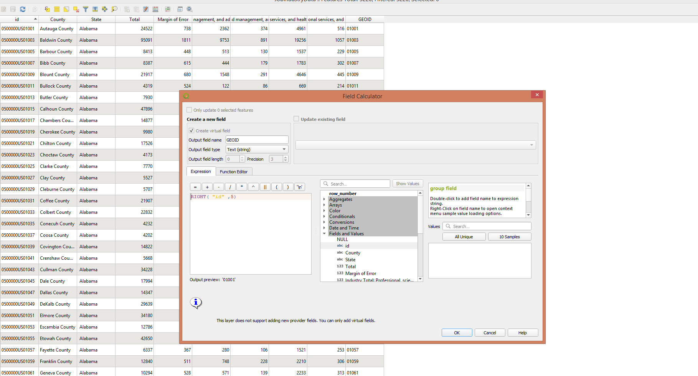
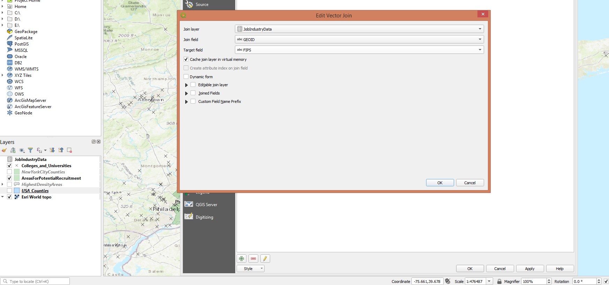
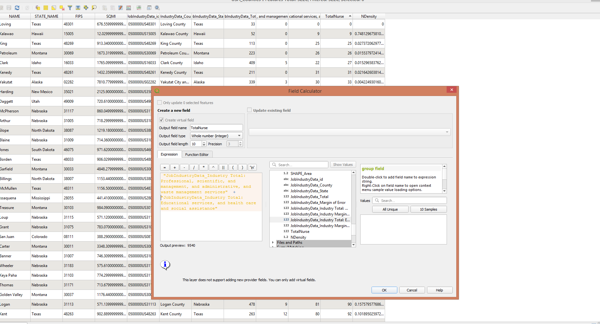
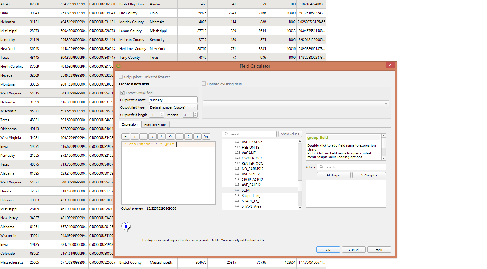

# Work Process Log

1. I gathered data sources from the above listed sites.  I needed a shapefile of the locations of colleges and universities in the United States.  When looking at census data to determine the general job industry of identified individuals, that which was available was at the county level.  Lastly, to align with the census data, I needed a shapefile of counties in the United States.

2. I cleaned the census data set by removing columns that contained data about job industries that weren't science or health care related.  I also removed the columns that broke down the numbers for occupation categories within each job industry.  The data was in a hierarchy of industry level category and then occupation category within the various industry level categories.  Put another way, I only looked at the total numbers at the industry level.  My decision to do this was based on the fact that I felt drilling into the data at the occupation level didn't necessarily help identify likely nurses anymore than the industry level data.  Upon further thought, I realize this could be an incorrect assumption and I feel it would be warranted to double check and compare the outcome when using the occupation level data.  This is something I would suggest as a further course of study.

3. I then pulled the shapefiles and cleaned data into QGIS using the add layer function.  I used ESRI World Topo from QuickMapServices as a backdrop for the layout I planned to make.

4. An important step for analysis included joining the job industry data to the counties shapefile that I had.  This was done using the layer properties and joins for the USA Counties layer.  In order to join this I could use the FIPS column from the counties shapefile in along with part of the id column in the job industry data set.  In the job industry data set, each id (row) corresponds with a county in the United States.  However, I needed only part of the id, specifically only the last 5 digits.

5. Getting the last 5 digits actually proved to be a bit of a challenge.  In Excel, I would insert a new column titled GEOID right in between the id column and the county column.  I would then use the following formula to extract the last 5 digits from id: (=RIGHT([column that id is in], 5)).  What became an issue was when pulling this into QGIS, because the column data type was a number, the program would cut off any values that had leading zeros.  Counties in states like Alabama and California were impacted by this and when trying to join the job industry data their rows would come back null.

6. The solution to this was to avoid creating the GEOID column in Excel and instead create it in QGIS.  So I pulled the cleaned job industry data into QGIS as JobIndustryData and then created the GEOID column within QGIS itself using the Field Calculator in the attribute table and ensured that the data type of the column was a text (string) type.  Doing this prevented the GEOID leading zeros from being removed and the solved the issues of nulls when joining this job industry data to the US counties.

7. Having joined the job industry data into the US counties layer, I calculated a column ("TotalNurse") totaling the number of jobs from science and healthcare related job industries in each county.  The name of the column is due to the character limit in QGIS for column headers.  This was also done with Field Calculator.

8. I then divided these values using the Field Calculator by the square mileage of each county to obtain the density of people in these job industries per square mile.  This column was called "NDensity".

9. The next step involved narrowing down counties to look at for high density of individuals in the science and health care job industries.  In order to do this I filtered the US Counties table on the NDensity column to only return rows with an NDensity greater than or equal to 250.  I exported these selected features to a layer called "HighestDensityAreas".

10. I then wanted to only return about 20 or so counties in total.  In order to have an even more condense result set, I filtered on this newly created layer further to only include counties with a NDensity greater than or equal to 850.  I exported these selected features and called this layer "AreasForPotentialRecruitment".

11. Within this newest result set, I calculated a column called "YouthPop", which consisted of the county totals of people aged 20 to 34.  This was obtained by adding together the values in columns "AGE_20_24" and "AGE_25_34" in the Field Calculator.  I wanted to factor in the size of the youth population when making my suggestion of counties and colleges to recruit from, so I thought these numbers would be useful.

12. I then displayed the polygon layer "AreasForPotentialRecruitment" as well as the layer "Colleges_and_Universities".

13. Within the attribute table for the "AreasForPotentialRecruitment" I looked at which counties remained relatively high in both density of workers and youth population.  Also keeping consideration of geographic location relative to UPMC in Pittsburgh, my place of employment at the time of the project, I chose to focus on counties surrounding Boston, Philadelphia, and New York City.

14. With these areas identified, I created my map layout displaying them along with the Eastern part of the United States.

## Data Sources:

Civilian Job Industry Data: https://data.census.gov/cedsci/table?tid=ACSDT5Y2019.C24050

Colleges and Universities: https://hifld-geoplatform.opendata.arcgis.com/datasets/colleges-and-universities?geometry=25.806%2C-16.798%2C-25.171%2C72.130

USA Counties: https://hub.arcgis.com/datasets/esri::usa-counties?geometry=-166.940%2C28.847%2C167.571%2C67.171
